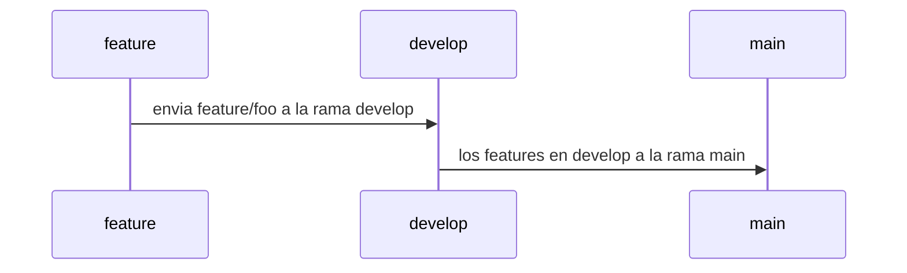

# # SOCIAL OPLESK
### 🏴‍☠️ HACK-GROUP

<br/>

📚 docs [markdown 1](https://agea.github.io/tutorial.md/) | [markdown 2](https://docs.github.com/es/get-started/writing-on-github/getting-started-with-writing-and-formatting-on-github/basic-writing-and-formatting-syntax) | [archivos de salud](https://docs.github.com/es/communities/setting-up-your-project-for-healthy-contributions/creating-a-default-community-health-file)
---
📚 docs [comandos git](https://gist.github.com/dasdo/9ff71c5c0efa037441b6) | [conventional commit](https://www.conventionalcommits.org/en/v1.0.0/)
---

```diff
- NOTA HACER LAS PRÁCTICAS MEDIANTE LA CONSOLA DE VSCODE y GITHUB
```

```
Se tienen 4 alias (alfa, bravo, charlie, delta), cada alia representa un integrante del equipo, 
si tu equipo tiene un integrante extra se llamara (echo) el procedimiento a realizar es el siguiente,
se necesita crear un circulo hábil en el manejo del pull request y manejo de flask, para tal fin. 

Los integrantes deben definir un admin rotativo(distinto) por cada hack

<br/>

|Hacks | Details | 
|----------|---------|
| H-1      | Basic |
| H-2      | Medium |
| H-3      | Advanced | 
```
---

### WORKFLOW



---

PULL_REQUEST_TEMPLATE
# Tipo de usuario
- [ ] Alfa
- [ ] Bravo 
- [ ] Charlie
- [ ] Delta
- [ ] Echo

# Tecnología
- [ ] Python 
- [ ] Markdown

# Seleccione el tipo de actividad
- [ ] Feature
- [ ] Hotfix
- [ ] Refactor
- [ ] Performance
- [ ] Testing

---

|Alias  | 
|----------------------------------------------------------------------------------------------------
| foo, baz, charlie, qux, delta, quux, echo, corge, grault, garply, waldo, fred, plugh, xyzzy, thud, foobar |

<br/> 

---

#TIPS
```
    Los integrantes del proyecto deben hacer una actualización de su sucursal(repositorio) local
    git remote add upstream url_del_repositorio_base
    git fetch upstream
    git switch main
    git merge upstream/main
 
    Cuando el encargado del repositorio este modo "code review" en el ambiente de main-test(rama local)
    seguir los pasos de forma estricta 
    git fetch origin pull/id_del_pull_request/head:nombreDelUsuario/nombre-de-la-feature-NÚMERO-DE-PR
    git switch main-test
    git merge nombreDelUsuario/nombre-de-la-feature-NÚMERO-DE-PR --no-commit
    git switch main  
    
    Conectar tú repositorio local, con el repositorio base
    git remote add upstream url_del_repositorio_base.git
    
    Si la escuadra quiere recibir los últimos cambios del repositorio base, realizar lo siguiente:
    git fetch upstream
    git merge upstream/main


url -> /buscar?q=info
@app.route('/buscar')
def buscar():
    query = request.args.get('q')
    return f'Resultados de búsqueda para: {query}'


url -> /buscar/info
@app.route('/saludo/<nombre>')
def saludo(nombre):
    return f'Hola, {nombre}!'

```
---

## 🏆 H-1

#### 👽 Basic (Hacks)
```sh
 1. Deben crear 1 repositorio "el grupo debe asignar el admin del repositorio base", como test_flask_1_1 dentro del equipo
    de alias (alfa, bravo, charlie, delta, echo) el administrador del repositorio 
    debe crear lo siguiente:
    - README.md -> sin contenido
    - pull_request_template.md -> anexar los datos del template
    - app.py -> Endpoint  "/" | method = "GET" | response => {"payload":"welcome to my project"}
    - crear la rama develop
  

 2. Cada colaborador debe hacer las siguiente acciones:
     
     * colaborador - 1
     - Crear -> Endpoint "/read" | method = "GET" | response => {"payload":"read successfully"}
     - README.md -> Editar para mostrar el return del endpoint /read  

     * colaborador - 2
     - Crear -> Endpoint "/create" | method = "POST" | response => {"payload":"create successfully"}
     - README.md -> Editar para mostrar el return del endpoint /create  

     * colaborador - 3
     - Crear -> Endpoint "/delete" | method = "DELETE" | response => {"payload":"delete successfully"}
     - README.md -> Editar para mostrar el return del endpoint /delete  

     * colaborador - 4
     - Crear -> Endpoint "/put" | method = "PUT" | response => {"payload":"put successfully"}
     - README.md -> Editar para mostrar el return del endpoint /put

     * admin - 5
     - Editar -> Endpoint "/" | method = "GET" | response => {"payload":"hack-1 finished"}
     - README.md -> Editar para indicar que los endpoints funcionan correctamente.
```     
 
---
## 🏆 H-2
#### 👽 Medium (Hacks)
```sh
 1. Deben crear 1 repositorio "el grupo debe asignar el admin del repositorio base", como test_flask_1_2 dentro del equipo
    de alias (alfa, bravo, charlie, delta, echo) el administrador del repositorio 
    debe crear lo siguiente:
    - README.md -> sin contenido
    - pull_request_template.md -> anexar los datos del template
    - app.py -> Endpoint  "/" | method = "GET" | response => {"payload":"welcome to my project"}
    - crear la rama develop
  

 2. Cada colaborador debe hacer las siguiente acciones:
     
     * colaborador - 1
     - Crear -> Endpoint "/read?content=foo" | method = "GET" | response => {"payload":foo}
     - README.md -> Editar para mostrar el return del endpoint /read  

     * colaborador - 2
     - Crear -> Endpoint "/create?content=bar" | method = "POST" | response => {"payload":bar}
     - README.md -> Editar para mostrar el return del endpoint /create  

     * colaborador - 3
     - Crear -> Endpoint "/delete?content=qux" | method = "DELETE" | response => {"payload":qux}
     - README.md -> Editar para mostrar el return del endpoint /delete  

     * colaborador - 4
     - Crear -> Endpoint "/put?content=echo" | method = "PUT" | response => {"payload":echo}
     - README.md -> Editar para mostrar el return del endpoint /put

     * admin - 5
     - Crear -> Endpoint "/init?content=alfa" | method = "GET" | response => {"payload":alfa}
     - README.md -> Editar para indicar que los endpoints funcionan correctamente.
```   

---

## 🏆 H-3
#### 👽 Advanced (Hacks)

```sh
 1. Deben crear 1 repositorio "el grupo debe asignar el admin del repositorio base", como test_flask_1_3 dentro del equipo
    de alias (alfa, bravo, charlie, delta, echo) el administrador del repositorio 
    debe crear lo siguiente:
    - README.md -> sin contenido
    - pull_request_template.md -> anexar los datos del template
    - app.py -> Endpoint  "/init" | method = "GET" | response => {"payload":"welcome to my project"}
    - crear la rama develop
  

 2. Cada colaborador debe hacer las siguiente acciones:
     
     * colaborador - 1
     - Crear -> Endpoint "/read/:content" | method = "GET" | response => {"payload":foo}
     - README.md -> Editar para mostrar el return del endpoint /read  

     * colaborador - 2
     - Crear -> Endpoint "/create/:content" | method = "POST" | response => {"payload":bar}
     - README.md -> Editar para mostrar el return del endpoint /create  

     * colaborador - 3
     - Crear -> Endpoint "/delete/:content" | method = "DELETE" | response => {"payload":qux}
     - README.md -> Editar para mostrar el return del endpoint /delete  

     * colaborador - 4
     - Crear -> Endpoint "/put/:content" | method = "PUT" | response => {"payload":echo}
     - README.md -> Editar para mostrar el return del endpoint /put

     * admin - 5
     - Crear -> Endpoint "/init/:content" | method = "GET" | response => {"payload":alfa}
     - README.md -> Editar para indicar que los endpoints funcionan correctamente.
```
